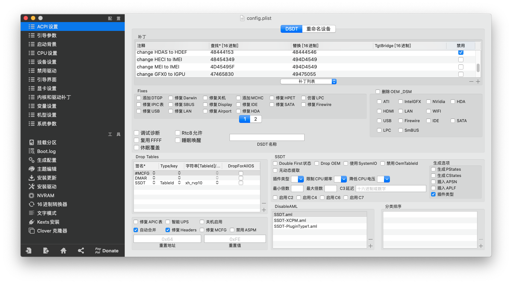
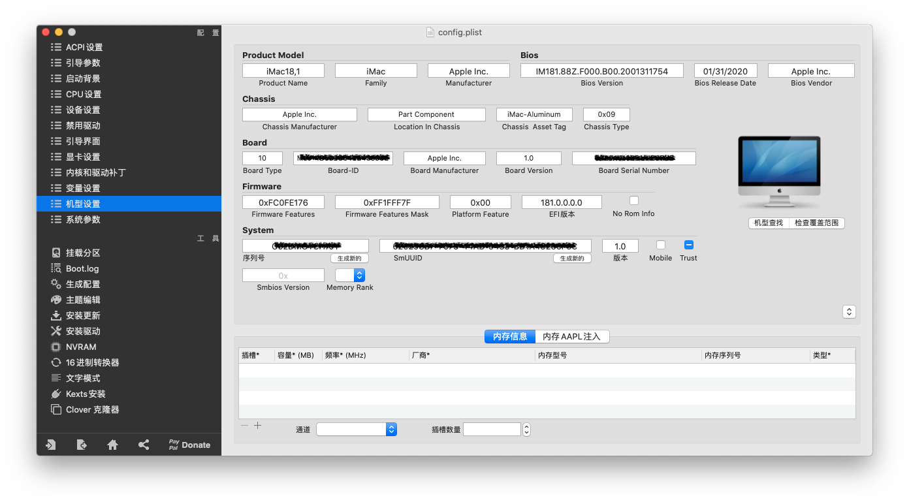

# Hackintosh_i5-7500_B250_HD630_EFI


***大部分驱动不再对 Clover 支持更新，所以建议使用 OpenCore 引导。以下内容也只适用于最高 macOS 10.15.7 。***


针对能正常使用于 `macOS Catalina 10.15.7`，只对核心显卡，网卡，声卡，以及 USB 做了相应的驱动设置。核心显卡，只选择机型，让 `WhateverGreen` 自动完成驱动。声卡使用 `AppleALC` 指定 `ID = 97`。可能不适应其他 macOS 版本。在介绍中的已知问题，如有解决的朋友请告知，多谢。


## 目录
- [硬件&系统](#硬件系统)
- [驱动情况](#驱动情况)
- [已知问题](#已知问题)
- [解决双系统时间不同步](#解决双系统时间不同步)
- [注入三码使正常使用 Apple 服务](#注入三码使正常使用-apple-服务)
- [开启 HiDPI](#开启-hidpi)
- [第三方 SSD 固态硬盘开启 TRIM](#第三方-ssd-固态硬盘开启-trim)
- [Clover Configurator 设置截图](#clover-configurator)


## 硬件&系统

| 名称 | 型号版本                      |
| ---- | ----------------------------- |
| 主板 | Gigabyte B250M-D3H            |
| CPU  | Intel i5 7500                 |
| 显卡 | Intel HD Graphics 630         |
| 声卡 | ALC892                        |
| 网卡 | i219-v                        |
| 系统 | macOS Catalina 10.15.7(19H15) |
| 引导 | Clover v5116                  |
| 机型 | iMac18,1                      |


## 驱动情况

- HD630 核显使用 `WhateverGreen-1.3.8_t3.kext` 正常
- 声卡使用 `AppleALC-1.3.9.kext` 输出、输入正常，注入 `ID = 97` (其他尝试可用：3，13，99)
- 网卡使用 `IntelMausiEthernet.kext` 正常
- `USB` 使用 `USBInjectAll_v0.7.4.kext` 正常识别 `USB3.0`,`USB2.0`
- 休眠正常
- 使用 `DIV` 接口正常
- 加入了 `ACPISensors.kext`、`CPUSensors.kext`、`GPUSensors.kext` 传感器，可删除不影响


## 已知问题

* 无法睡眠，临时解决方法使用以下命令防止进入睡眠模式：
  ``` bash
  sudo pmset -a disablesleep 1
  ```
  当此值设为 1 时，将停用所有睡眠功能。Apple 菜单中的“睡眠”项目还会变暗（“呈灰显状态”）。设为 0 时，可恢复停用的睡眠功能。
  
* HDMI、DP 接口无显示


## 解决双系统时间不同步

在安装了 Windows 与 macOS 两个系统时，Windows 的时间会慢 8 个小时，使用以下命令让 Windows 把硬件时间当作 UTC 时间。Windows 使用管理员启动命令行开启 UTC ：
Windows 注册表：开启 UTC

``` bash
[HKEY_LOCAL_MACHINE\SYSTEM\CurrentControlSet\Control\TimeZoneInformation]
"RealTimeIsUniversal"=dword:00000001
```
Windows 注册表：关闭 UTC
``` bash
[HKEY_LOCAL_MACHINE\SYSTEM\CurrentControlSet\Control\TimeZoneInformation]
"RealTimeIsUniversal"=dword:00000000
```


## 注入三码使正常使用 Apple 服务

在正确注入有效三码后，可以正常使用 `iMessage`、`FaceTime`、`Siri` 和 `App Store` 。使用 `iMessageDebug` 工具可读取本机三码。

这里将 `iMessageDebug` 工具放到桌面，终端命令给 `iMessageDebug` 执行权限 ：
``` bash
sudo chmod a+x /Users/admin/Desktop/iMessageDebug
```
双击 `iMessageDebug` 执行，将在终端打印出三码内容，按 y 还可以将三码内容保存到桌面文件中，使用 `Clover Configurator` 编辑 `config.plist` 文件：

- `ROM` : `Rt Variables` -> `ROM`
- `BoardSerialNumber` : `Rt Variables`(变量设置) -> `MLB`
- `SerialNumber` : `SMBIOS`(机型设置) -> `Serial Number`
- `BoardSerialNumber` : `SMBIOS`(机型设置) -> `Board Serial Number`
- `Hardware UUID` : `SMBIOS`(机型设置) -> `SmUUID`
- `System-ID` : `System Parameters`(系统参数) -> `Custom UUID`
- 最后勾选 `Inject System ID`


## 开启 HiDPI
- 开启 HiDPI
``` bash
sudo defaults write /Library/Preferences/com.apple.windowserver.plist DisplayResolutionEnabled -bool true
```
需要重启电脑生效。
- 关闭 HiDPI
``` bash
sudo defaults delete /Library/Preferences/com.apple.windowserver.plist DisplayResolutionEnabled
```
需要重启电脑生效。
- 安装 RDM 工具，方便设置分辨率，分辨率后带闪电标志的，表示支持 HiDPI 显示 
http://avi.alkalay.net/software/RDM/


## 第三方 SSD 固态硬盘开启 TRIM
开启 TRIM 能让 SSD 在长期使用中有更长的使用寿命及更快的速度。使用终端命令：
``` bash
sudo trimforce enable
```


## Clover Configurator



 *Tip: 下图在 Clover 引导界面隐藏了 `Recovery`、`Windows`启动盘符，如果需要显示请删除。*





[返回顶部](#hackintosh_i5-7500_b250_hd630_efi)