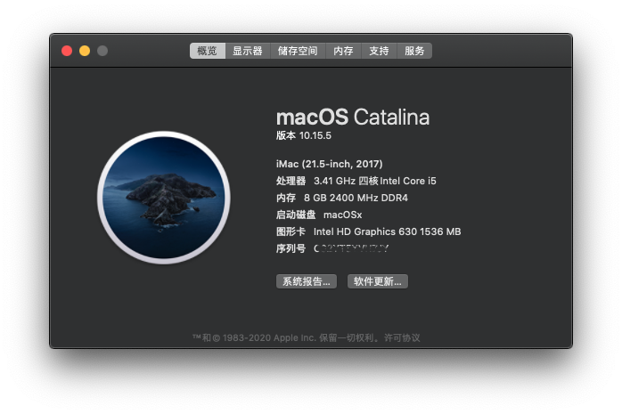
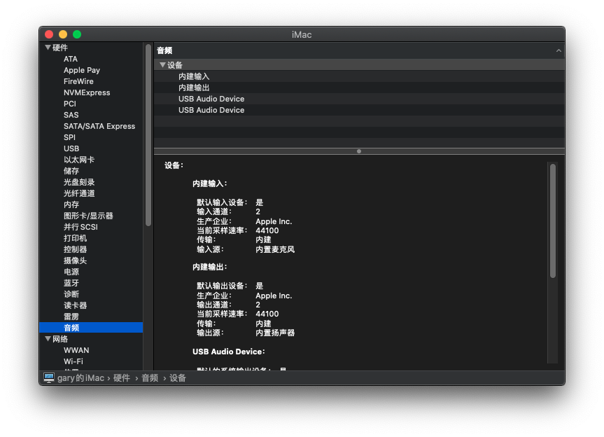
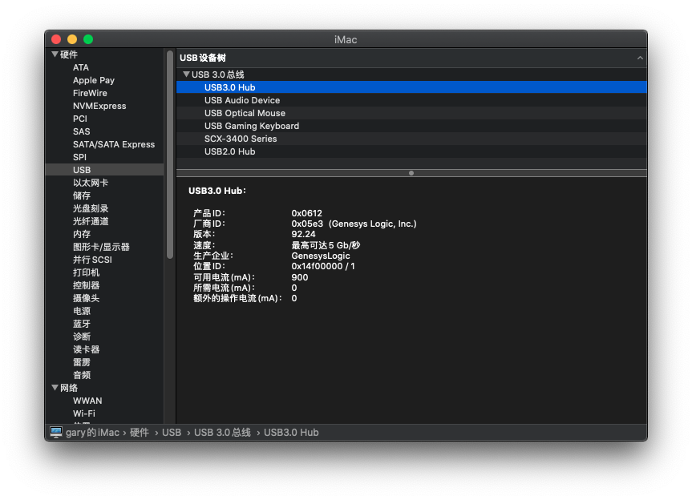
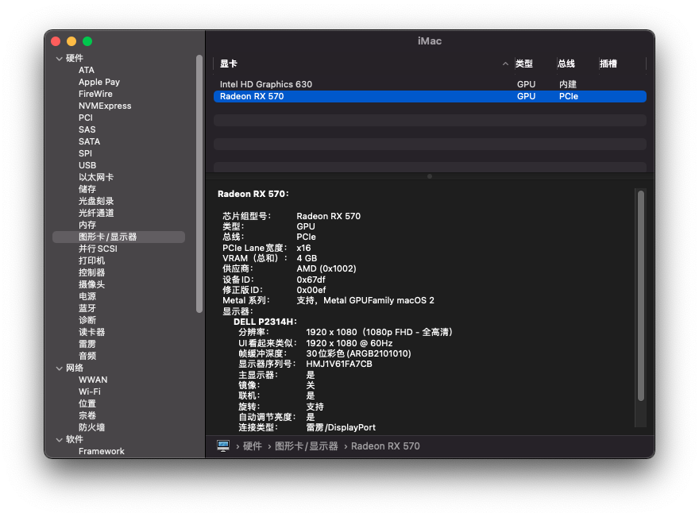
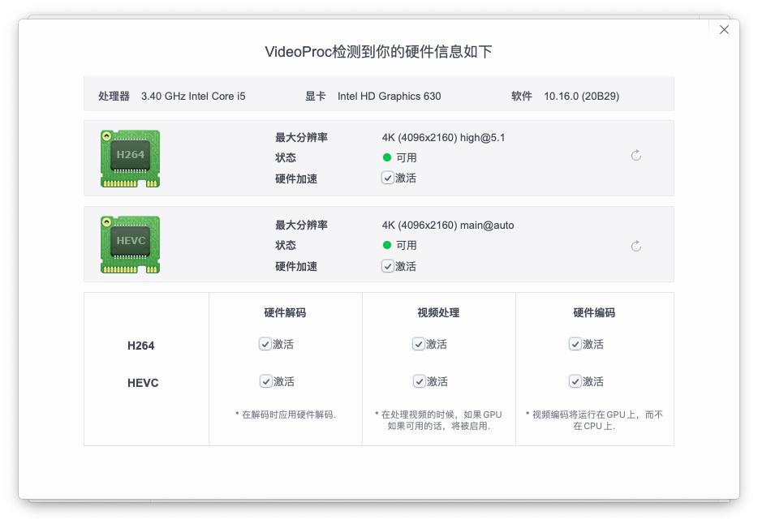
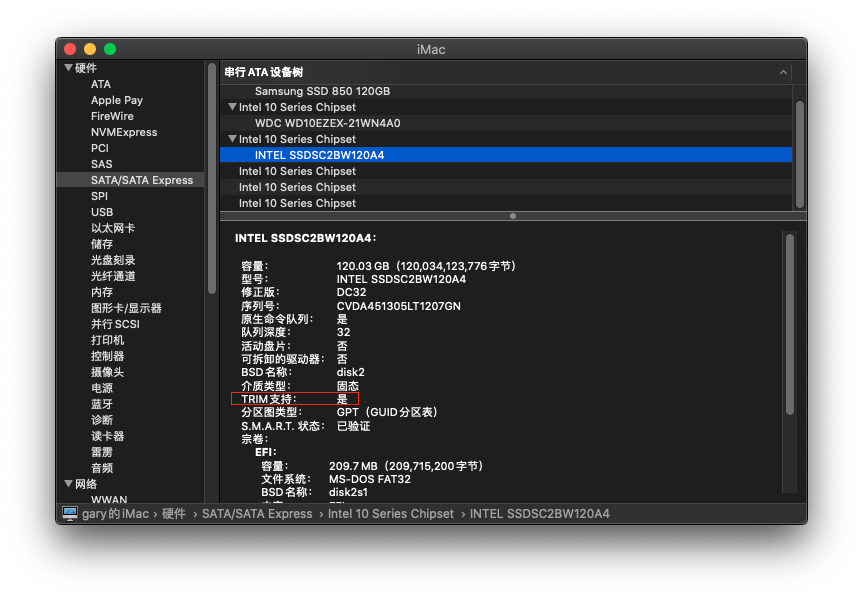

# Hackintosh_i5-7500_B250_RX570_EFI
针对能正常使用于 `macOS Big Sur 11.01`，也可用于 `macOS Catalina 10.15.7`。对核心显卡，独立显卡，网卡，声卡，以及 USB 做了相应的驱动设置。在介绍中的已知问题，如有解决的朋友请留言告知，多谢。

> 以往的 Clover 引导保留在 `Clover_EFI` 文件夹中。适用没有使用独立显卡的配置，但只能停留在 `macOS Catalina 10.15.7` ,因为我无法在 `macOS Big Sur` 中正确驱动核显 HD630。








## 目录
- [硬件&系统](#硬件系统)
- [驱动情况](#驱动情况)
- [已知问题](#已知问题)
- [BIOS 设置](#BIOS-设置)
- [OpenCore 文件说明](#OpenCore-文件说明)
- [解决双系统时间不同步](#解决双系统时间不同步)
- [注入三码使正常使用 Apple 服务](#注入三码使正常使用-apple-服务)
- [开启 HiDPI](#开启-hidpi)
- [第三方 SSD 固态硬盘开启 TRIM](#第三方-ssd-固态硬盘开启-trim)


## 硬件&系统

| 名称     | 型号版本                      |
| -------- | ----------------------------- |
| 主板 | Gigabyte B250M-D3H            |
| CPU  | Intel i5 7500                 |
| 核显 | Intel HD Graphics 630         |
| 独显 | Sapphire RX570 4G D5 OC       |
| 声卡     | ALC892                        |
| 网卡     | i219-v                        |
| SSD     | SATA 接口的 Intel SSD   |
| 系统     | macOS Big Sur 11.01(20B29) |
| 引导     | OpenCore 0.6.3                |
| 机型     | iMac18,1、iMac18,2、iMac18,3  |


## 驱动情况

- `HD630` 核显使用 `WhateverGreen.kext` 驱动，可用于视频解码硬件加速。
- 声卡使用 `AppleALC.kext` 输出、输入正常，注入 `alcid = 97` (其他尝试可用：3，13，99)
- 网卡使用 `IntelMausi.kext` 正常
- `USB` 使用 `USBInjectAll.kext` 正常识别 `USB3.0`,`USB2.0`
- 休眠正常
- `RX570` 独立显卡 `macOS` 免驱。使用独立显卡接口，以测试两个 `DP` 接口正常。


## 已知问题

* 无法睡眠，睡眠后马上自动唤醒，临时解决方法使用以下命令防止进入睡眠模式：
  ``` bash
  sudo pmset -a disablesleep 1
  ```
  当此值设为 1 时，将停用所有睡眠功能。Apple 菜单中的“睡眠”项目还会变暗（“呈灰显状态”）。设为 0 时，可恢复停用的睡眠功能。
  


## BIOS 设置

###  `Gigabyte B250M-D3H` 主板

加粗项为必须设置的。

- `M.I.T`
- `Miscellaneous Settings` 
  - **`CFG Lock` = `Disabled`**
- `BIOS`
  - **`Fast Boot` = `Disabled`**
  - `Windows 8/10 Features` = `Windows 8/10`
  - **`CSM Support` = `Disabled`**
- `Peripherals`
  - `Initial Display Output` = `IGFX`

  - **`SW Guard Extensions (SGX)` = `Disabled`**
  - `Super IO Configuration`
    - `Serial Port` = `Disabled`
    - `Parallel Port` = `Disabled`
  - `USB Configuration`
    - **`Legacy USB Support` = `Enabled`**
    - **`XHCI Hand-off` = `Enabled`**
  - `SATA And RST Configuration`
    - **`SATA Mode Selection` = `AHCI`**
- `Chipset`
  - **`VT-d`  = `Disabled`**
  - `Internal Graphics` = `Enabled`
  - `DVMT Pre-Allocated` = `64M`
  - `DVMT Total Gfx Mem` = `256M`


### 通用 BIOS 设置

- 禁用：

  - `Fast Boot` (快速启动)
  - `CFG Lock` (CFG 锁)
  - `VT-d`
  - `CSM`
  - `Intel SGX`

- 启用：
  - `VT-x`
  - `Above 4G decoding` (大于 4G 地址空间解码)
  - `Hyper Threading` (超线程)
  - `Execute Disable Bit` (执行禁止位)
  - `EHCI/XHCI Hand-off` (接手 EHCI/XHCI 控制)
  - `OS type : Windows 8.1/10` (操作系统类型：Windows 8.1/10)
  - `Legacy RTC Device` (传统 RTC 设备)


## OpenCore 文件说明

#### /

- `config.plist` - 必须， OpenCore 配置文件。
- `OpenCore.efi` - 必须，OpenCore 启动引导文件。


#### ACPI

补丁文件，如果硬件配置并不一样，很可能需要修改以下文件：

- `SSDT-EC.aml` 必须，因为当前 DSDT 中为 H_EC 。
- `SSDT-PLUG.aml` 必须，注入 X86，实现 CPU 电源管理。
- `SSDT-SMBS.aml` 可选，注入 SBUS 设备，USB 电源相关。


#### Bootstrap

- `Bootstrap.efi` 兼容启动相关，在下面 `config.plist` 中并未使用，可以忽略。


#### Drivers

- `HFSPlus.efi` 必须，苹果自带 HFS 格式支持、在安装MAC或者更新时需要此驱动
- `OpenRuntime.efi` 必须，内存寻址补丁。
- `Ps2KeyboardDxe.efi` 可选，PS2 接口键盘驱动
- `Ps2MouseDxe.efi` 可选，PS2 接口鼠标驱动
- `UsbMouseDxe.efi` 可选，USB 接口鼠标驱动


#### Kexts

- `AppleALC.kext` 声卡驱动
- `IntelMausi.kext`  Intel 有线网卡驱动
- `Lilu.kext` 必须，很多其它驱动需要依赖它
- `USBInjectAll.kext` USB 驱动
- `VirtualSMC.kext` 传感器驱动
- `WhateverGreen.kext` Intel 核心显卡驱动


#### Resources

OpenCore 启动时的主题样式相关，可忽略。


#### Tools

OpenCore 启动时要加载的工具程序，可忽略。


## 解决双系统时间不同步

在安装了 Windows 与 macOS 两个系统时，Windows 的时间会慢 8 个小时，使用以下命令让 Windows 把硬件时间当作 UTC 时间。Windows 使用管理员启动命令行开启 UTC ：
Windows 注册表：开启 UTC

``` bash
[HKEY_LOCAL_MACHINE\SYSTEM\CurrentControlSet\Control\TimeZoneInformation]
"RealTimeIsUniversal"=dword:00000001
```
Windows 注册表：关闭 UTC
``` bash
[HKEY_LOCAL_MACHINE\SYSTEM\CurrentControlSet\Control\TimeZoneInformation]
"RealTimeIsUniversal"=dword:00000000
```


## 注入三码使正常使用 Apple 服务

在正确注入有效三码后，可以正常使用 `iMessage`、`FaceTime`、`Siri` 和 `App Store` 等服务。

获取三码有几种方法：使用 `CloverConfigurator`、`OpenCore Configurator`、`iMessageDebug` 和 `GenSMBIOS` 等工具。

另外还需要一个编辑 `OpenCore` 配置文件的编辑器，这里使用 `ProperTree ` https://github.com/corpnewt/ProperTree

无论使用哪种工具，只需要获得的三码(准确说是四个码)，填到 `OpenCore` 的 `config.plist` 文件的对应位置：

打开  `config.plist` 文件可以找到以下项 :

- PlatformInfo
  - Generic
  
    - MLB
  
    - SystemProductName
  
    - SystemSerialNumber
  
    - SystemUUID

这里将使用 `GenSMBIOS` 工具，因为它可以在 `Windows` 和 `macOS` 下工作，该工具的仓库地址：https://github.com/corpnewt/GenSMBIOS

该工具使用 `Python` 编写，所以还需要安装 `Python` 环境，在 mac 下是系统默认有安装的，windows 下可能需要自己下载安装 https://www.python.org

下载 `GenSMBIOS` 工具后 `macOS1` 运行 `GenSMBIOS.command` 脚本，Windows 下运行 `GenSMBIOS.bat` 

- `GenSMBIOS` 菜单选择 `3. Generate SMBIOS`  

  ```bash
  MacSerial v2.1.2
  Current plist: None
  Plist type:    Unknown
  
  1. Install/Update MacSerial
  2. Select config.plist
  3. Generate SMBIOS
  4. Generate UUID
  5. List Current SMBIOS
  
  Q. Quit
  
  Please select an option:
  ```

- 输入要与硬件配置相近的机型编号，如这里使用的 `iMac18,3`

  ``` bash
  Please type the SMBIOS to gen and the number
  of times to generate [max 20] (i.e. iMac18,3 5):  iMac18,3
  ```

- 得到以下四个随机码

  ``` bash
  Type:         iMac18,3
  Serial:       C02TW0A1J1GJ
  Board Serial: C027251084NJ0PGA8
  SmUUID:       D0BD3E6A-E2D5-4FF5-BB26-005C96B1A976
  ```

- 分别填入 `config.plist` 中对应的项

  - PlatformInfo
    - Generic
      - MLB : C027251084NJ0PGA8 (Board Serial)
      - SystemProductName : iMac18,3 (Type)
      - SystemSerialNumber : C02TW0A1J1GJ (Serial)
      - SystemUUID : D0BD3E6A-E2D5-4FF5-BB26-005C96B1A976 (SmUUID)

- 最后设置下面四项

  - UpdateDataHub = True

  - UpdateNVRAM = True

  - UpdateSMBIOS = True

  - UpdateSMBIOSMode = Create

  

> TIP: 不要使用这里填好的四码内容，可能会无效。应该使用 `GenSMBIOS` 生成一组新的。


## 开启 HiDPI
开启 HiDPI 以实现分辨缩放。建议在 2k 显示器以上才使用。

- 开启 HiDPI
``` bash
sudo defaults write /Library/Preferences/com.apple.windowserver.plist DisplayResolutionEnabled -bool true
```
需要重启电脑生效。
- 关闭 HiDPI
``` bash
sudo defaults delete /Library/Preferences/com.apple.windowserver.plist DisplayResolutionEnabled
```
需要重启电脑生效。
- 安装 RDM 工具，方便设置分辨率，分辨率后带闪电标志的，表示支持 HiDPI 显示 
http://avi.alkalay.net/software/RDM/


## 第三方 SSD 固态硬盘开启 TRIM
开启 TRIM 能让 SSD 在长期使用中有更长的使用寿命及更快的速度。使用终端命令：
``` bash
sudo trimforce enable
```


[返回顶部](#Hackintosh_i5-7500_B250_RX570_EFI)