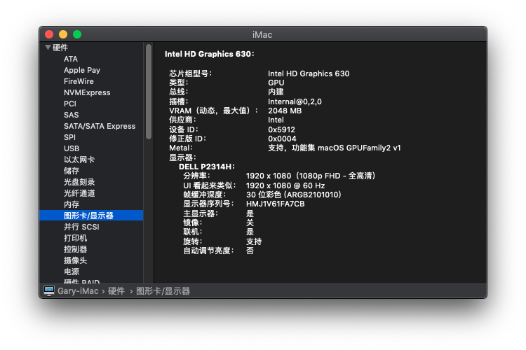
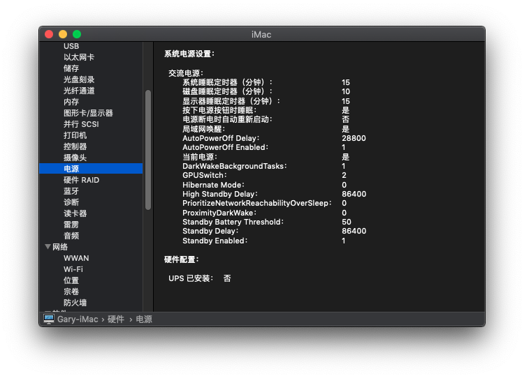

Hackintosh_i5-7500_B250_HD630_EFI
====

硬件&系统
----
* 主板：GIGABYTE B250M-D3H
* CPU：Intel i5 7500
* 显卡：Intel HD Graphics 630
* 使用安装镜像 10.15.2 (18G1012)
* 使用 Clover 引导
* 使用机型 iMac18,1

驱动情况
----
* HD630 核显使用 WhateverGreen_v1.3.1.kext 正常
* 声卡使用 AppleALC.kext 输出、输入正常
* 网卡使用 AppleIntelE1000e.kext 正常
* USB 使用定制端口 USBPorts.kext 正常
* 休眠正常
* 使用 DIV 接口正常

问题
----
* DP、HDMI 待测试，4k 支持待测试。